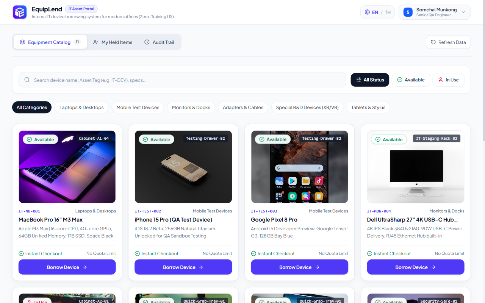
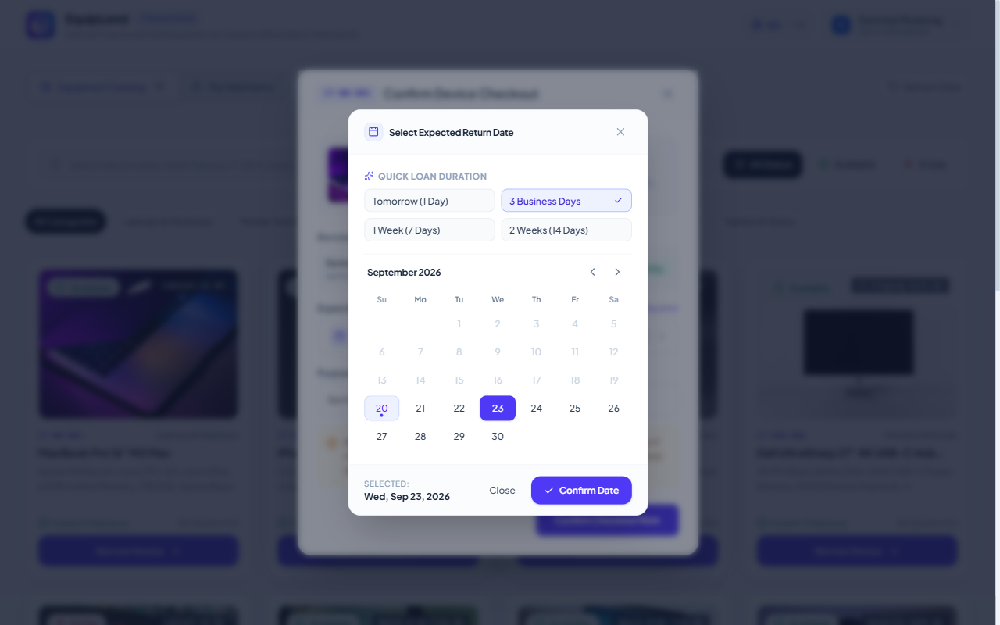
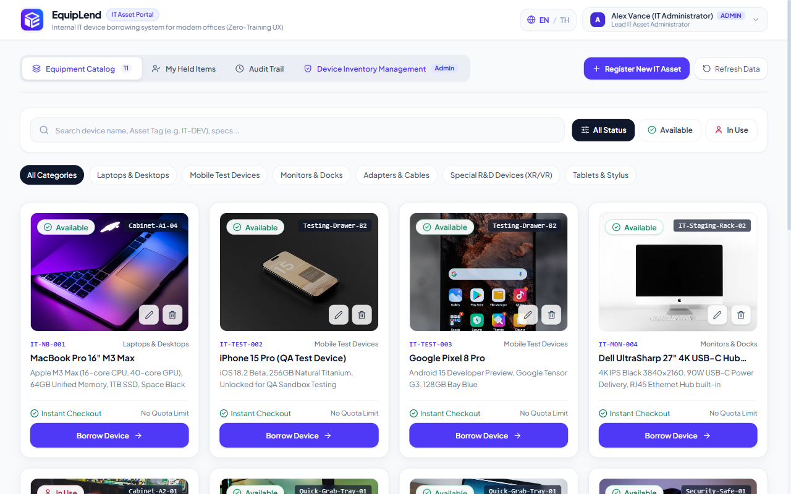
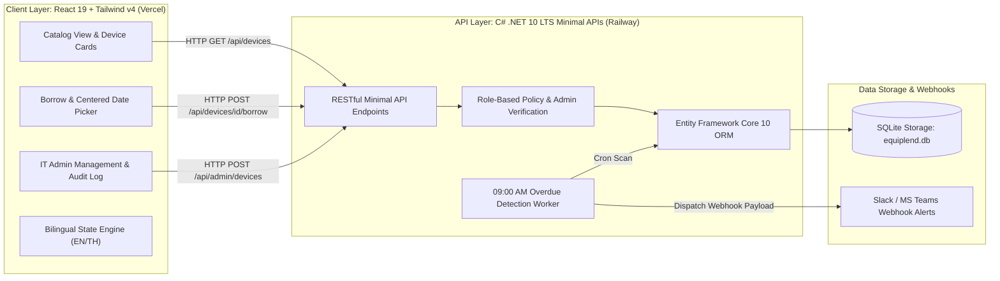
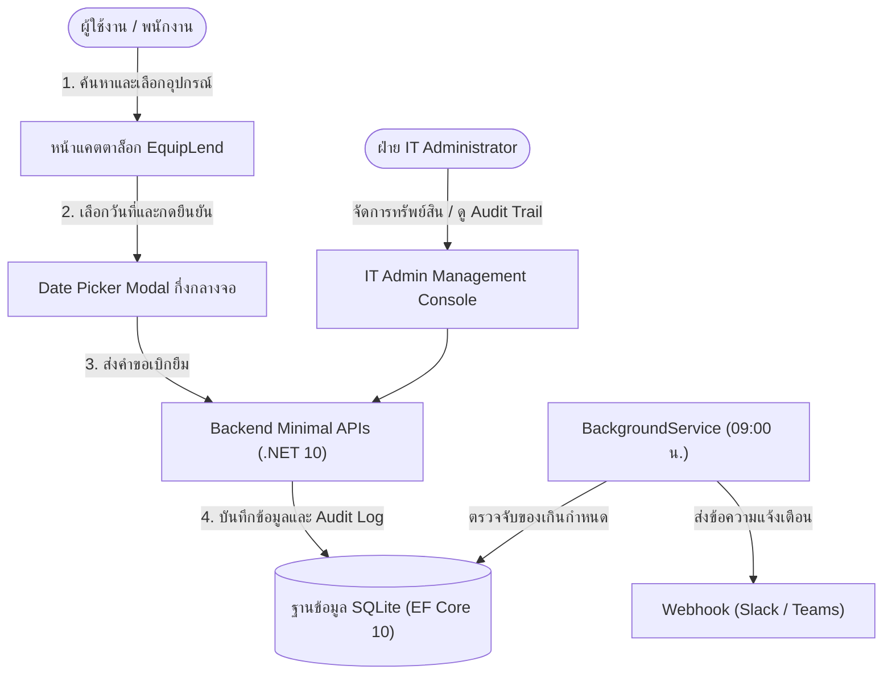

# EquipLend — Internal Device & IT Asset Checkout System
### ระบบเบิก-ยืมอุปกรณ์ไอทีส่วนกลางในสำนักงาน (Zero-Training UX)

<div align="center">


[](https://equiplend.vercel.app/)
[](https://railway.com/)
[](https://dotnet.microsoft.com/)
[](https://react.dev/)
[](https://tailwindcss.com/)
[](https://www.sqlite.org/)

**[English](#english) • [ภาษาไทย](#ภาษาไทย)**

</div>

---

<a name="english"></a>
## English Overview

### 1. Who (Target Audience & Personas)
- **Engineers, QA Testers & Designers**: Fast, friction-free self-service checkout for test devices (iOS/Android), external monitors, docking stations, VR headsets, and display adapters without paperwork or delays.
- **IT Support & Asset Operations**: Complete real-time transparency over internal hardware custody, automated overdue asset recovery, and a secure tamper-evident operations audit trail.

---

### 2. Problem Statement
In fast-paced engineering offices, shared IT peripherals and testing hardware frequently cause operational bottlenecks:
1. **Asset Drift & Ghost Checkouts**: Peripherals are borrowed casually and not returned, leaving team members hunting through chat channels to identify who holds critical hardware.
2. **Untracked Peer Handovers**: Colleagues pass devices directly to one another, breaking the chain of custody and corrupting IT asset records.
3. **Manual Follow-up Overhead**: IT staff spend excessive hours manually tracking down overdue devices and inspecting returned hardware condition.

---

### 3. Solution & Value Proposition
**EquipLend** transforms workplace hardware lending into a frictionless self-service experience:
- **Zero-Training UX**: Designed like an intuitive digital catalog. Real-time availability badges (`Available` with emerald vector check, `In Use` with high-contrast red indicator).
- **Mandatory Return to IT Only**: Assets must be checked back into the central IT hub to inspect physical condition and safely reset custody.
- **Automated Waitlist Alerts**: Subscribed employees are notified the instant an in-demand device is returned to IT.
- **Role-Based Access Control**: Sensitive audit logs and hardware CRUD management are protected and exclusive to IT Administrators.
- **Full Bilingual Localization**: Seamless one-click English/Thai switching (Default: EN).

---

### 4. Key Highlights & Features
- **Modern Hardware Catalog**: Instant category filtering (Laptops, Mobile Test Devices, Monitors & Docks, Adapters & Cables, XR/VR R&D, Tablets) with real-time text search.
- **Screen-Centered Modern Date Picker**: Custom-engineered modal calendar featuring quick-duration presets (1 Day, 3 Days, 1 Week, 2 Weeks), month navigation, and affirmative confirmation.
- **Autonomous Background Overdue Service**: C# .NET 10 `BackgroundService` monitors overdue items every morning at 09:00 AM and dispatches webhook notifications (Slack/Teams).
- **IT Operations & Audit Trail**: Chronological event ledger recording every action (`BORROW`, `RETURN`, `WATCHLIST_SUBSCRIBED`, `ADMIN_CREATE_DEVICE`, `ADMIN_UPDATE_DEVICE`, `ADMIN_DELETE_DEVICE`).
- **Hardware Asset Management**: IT Admins can register new assets with direct file uploads or external URLs, update technical specifications, or decommission equipment.

---

### 5. Visual Demonstration

#### Equipment Catalog & Modern Kiosk Interface


#### Screen-Centered Modern Date Picker Modal


#### IT Administrator Console & Operations Log


---

### 6. System Architecture & Engineering Design



#### Technical Stack & Architectural Rationale
| Layer | Technology | Architectural Rationale |
|---|---|---|
| **Frontend** | React 19 + TypeScript | High-performance component rendering with strict type safety. |
| **Styling** | Tailwind CSS v4 | Zero-runtime CSS variables and modern utility tokens. |
| **Backend** | .NET 10 LTS Minimal APIs | Compact, single-file API architecture with high throughput and low memory footprint. |
| **ORM** | Entity Framework Core 10 | Code-First SQLite persistence with WAL (Write-Ahead Logging) enabled. |
| **Scheduler** | .NET `IHostedService` | Self-contained background cron runner operating at 09:00 AM daily. |
| **Cloud Hosting** | Vercel + Railway | Edge frontend delivery paired with containerized .NET runtime. |

---

### 7. Deployment & Local Verification

#### Live Production Deployments
- **Web Application**: [https://equiplend.vercel.app/](https://equiplend.vercel.app/)
- **Source Repository**: [https://github.com/ZillerDX/equiplend](https://github.com/ZillerDX/equiplend)

#### Local Development Setup
```powershell
# 1. Clone the repository
git clone https://github.com/ZillerDX/equiplend.git
cd equiplend

# 2. Run Backend (.NET 10 LTS)
cd backend/EquipLend.Api
dotnet run --urls "http://localhost:5080"

# 3. Run Frontend (React 19 + Vite) in a separate terminal
cd ../../frontend
npm install
npm run dev
```
Open [http://localhost:3000](http://localhost:3000) in your browser.

---

<br />

---

<a name="ภาษาไทย"></a>
## รายละเอียดภาษาไทย (Thai Documentation)

### 1. กลุ่มผู้ใช้งานเป้าหมาย (Who)
- **ทีมวิศวกรรม ซอฟต์แวร์ และ QA เทสเตอร์**: เบิก-ยืมเครื่องเทสต์ (iPhone/Android), จอเสริม 4K, ด็อกกิ้ง หรือสายแปลงได้ด้วยตนเองในเวลาไม่กี่วินาที
- **ฝ่าย IT Operations & Support**: ตรวจสอบการถือครองอุปกรณ์ส่วนกลางในออฟฟิศได้แบบ Real-Time ตรวจสภาพเครื่องเมื่อส่งคืน และมีระบบตรวจจับของค้างส่งคืนอัตโนมัติ

---

### 2. ปัญหาที่พบในสำนักงานจริง (Problem Statement)
1. **อุปกรณ์สูญหาย / หาตัวคนยืมไม่เจอ**: พนักงานหยิบสายแปลงหรือเครื่องเทสต์ไปใช้งานแล้วลืมคืน เมื่อคนอื่นต้องการใช้ต้องเดินถามทั่วออฟฟิศ
2. **การส่งต่อกันเองโดยไม่ผ่านระบบ (Chain of Custody Failure)**: ส่งต่อให้เพื่อนร่วมงานยืมต่อทันที ทำให้ข้อมูลในระบบคลาดเคลื่อนและไม่สามารถระบุผู้รับผิดชอบได้
3. **ภาระงานติดตามของฝ่าย IT**: ต้องคอยทวงถามของค้างส่งคืนทีละคนโดยไม่มีระบบแจ้งเตือนอัตโนมัติ

---

### 3. แนวทางแก้ไขและคุณค่าของระบบ (Solution)
**EquipLend** เปลี่ยนขั้นตอนการเบิกอุปกรณ์ให้สะดวก รวดเร็ว และเป็นระบบ:
- **Zero-Training UX**: หน้าตาใช้งานง่ายเหมือนแคตตาล็อกร้านค้าออนไลน์ แสดงสถานะชัดเจน (🟢 พร้อมยืม / 🔴 มีผู้ใช้งานอยู่)
- **นโยบายส่งคืนผ่านฝ่าย IT เท่านั้น (Return to IT Only)**: ผู้ยืมต้องนำของมาคืนที่จุดรวมอุปกรณ์ไอทีส่วนกลาง เพื่อตรวจสภาพและรีเซ็ตประวัติอย่างถูกต้อง
- **ระบบคิวแจ้งเตือนเมื่อของว่าง (Watchlist Notification)**: กดรับแจ้งเตือนเมื่ออุปกรณ์ชิ้นที่ต้องการถูกนำมาส่งคืน
- **จำกัดสิทธิ์ความปลอดภัย (Role-Based Access)**: ฟังก์ชัน Audit Trail และการจัดการเพิ่ม/ลบอุปกรณ์ถูกสงวนสิทธิ์ไว้เฉพาะ IT Admin เท่านั้น
- **รองรับ 2 ภาษา**: สลับเปลี่ยนภาษาอังกฤษและไทยได้ตลอดเวลา (Default: EN)

---

### 4. ฟีเจอร์หลัก (Key Features)
- **แคตตาล็อกอุปกรณ์แยกหมวดหมู่ชัดเจน**: ค้นหาด่วนตามชื่อ สเปก หรือรหัสทรัพย์สิน (Asset Tag)
- **Date Picker ปฏิทินดีไซน์ทันสมัย**: แสดงผลแบบ Modal ป๊อปอัปกึ่งกลางหน้าจอ พร้อมปุ่มระยะเวลายืมด่วน (1 วัน, 3 วันทำการ, 1 สัปดาห์, 2 สัปดาห์)
- **C# .NET 10 BackgroundService Overdue Monitor**: รันตรวจสอบอุปกรณ์เกินกำหนดทุกเช้าเวลา 09:00 น. พร้อมส่ง Webhook แจ้งเตือนไปยัง Slack / Microsoft Teams
- **บันทึกประวัติการดำเนินงาน (IT Audit Trail)**: ตรวจสอบความเคลื่อนไหวย้อนหลังได้ 100% พร้อมตัวเลขสถิติภาพรวม
- **IT Admin Console**: จัดการเพิ่ม แก้ไข ลบ อุปกรณ์ พร้อมรองรับการอัปโหลดไฟล์ภาพจากเครื่องหรือ Image URL

---

### 5. ผังการทำงานของระบบ (Architecture Diagram)



---

### 6. การติดตั้งและทดสอบในเครื่อง (Local Setup)

```powershell
# 1. Clone โค้ดจาก GitHub
git clone https://github.com/ZillerDX/equiplend.git
cd equiplend

# 2. เริ่มการทำงาน Backend (.NET 10 LTS)
cd backend/EquipLend.Api
dotnet run --urls "http://localhost:5080"

# 3. เริ่มการทำงาน Frontend (React 19) ในอีก Terminal หนึ่ง
cd ../../frontend
npm install
npm run dev
```
เปิดใช้งานผ่านเว็บเบราว์เซอร์ที่ [http://localhost:3000](http://localhost:3000)

---

### 7. ข้อมูลการเผยแพร่ระบบ (Production Links)
- **ระบบบน Production (Vercel)**: [https://equiplend.vercel.app/](https://equiplend.vercel.app/)
- **GitHub Repository**: [https://github.com/ZillerDX/equiplend](https://github.com/ZillerDX/equiplend)
- **Backend API Hosting**: [Railway Cloud Platform](https://railway.com/)

---

<div align="center">
  <sub>Crafted with engineering discipline by Tanathon Chanapha (ZillerDX) • Powered by .NET 10 & React 19</sub>
</div>
